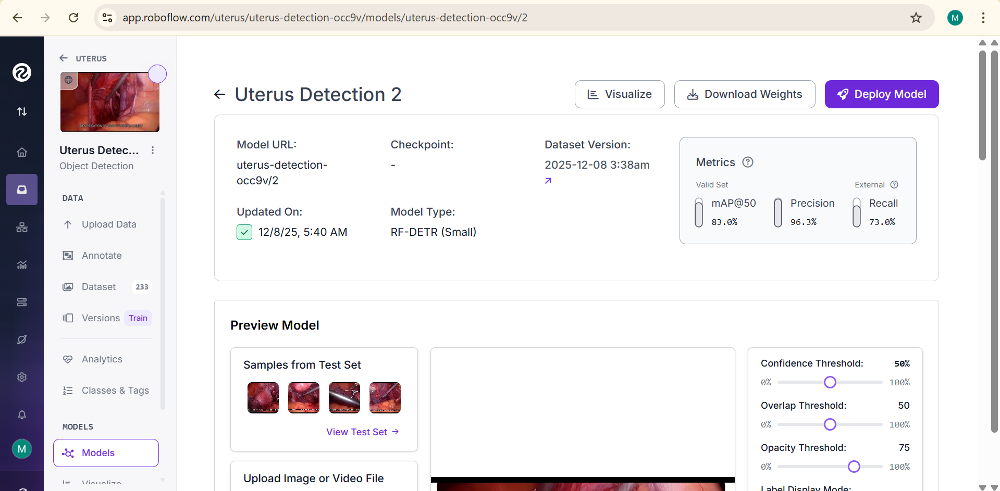
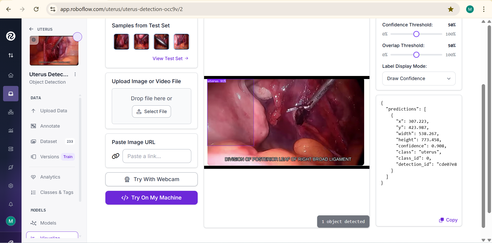
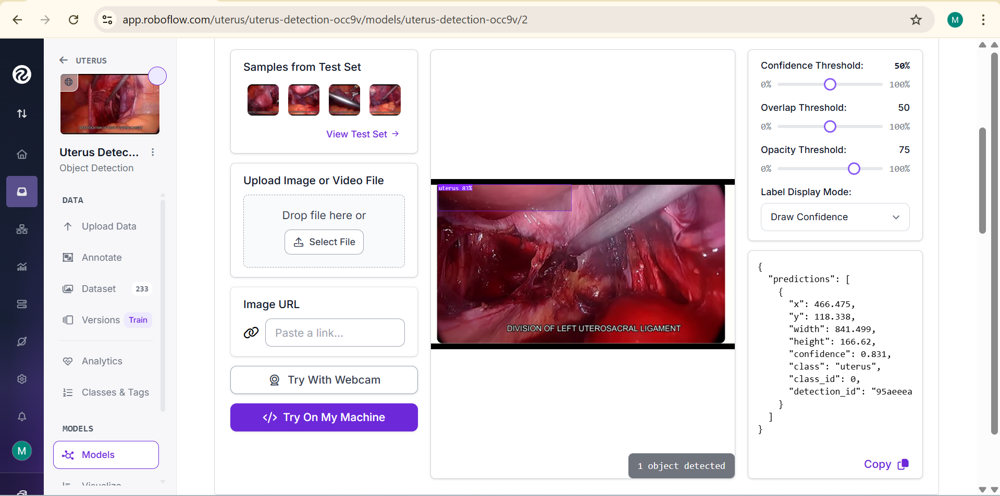

# Uterus Detection in Laparoscopic Surgery

This repository documents an AI-based approach to detect and annotate the uterus in laparoscopic surgery videos. The focus of this project is on data preparation, annotation, and model training using Roboflow.

## Problem Statement
Accurate identification of organs during minimally invasive surgery can assist surgeons and reduce cognitive load. This project focuses on detecting the uterus from laparoscopic surgery videos.

## Approach
1. Collected laparoscopic surgery video data.
2. Extracted frames from videos for dataset creation.
3. Annotated uterus regions using Roboflow.
4. Trained an object detection model using Roboflow (RF-DETR Small).
5. Evaluated the model on unseen frames and videos within Roboflow.
   
## Dataset
- Frames extracted from laparoscopic surgery videos
- Annotated manually using Roboflow
- Single class: uterus

## Model Details
- Platform: **Roboflow**
- Architecture: **RF-DETR (Small)**
- mAP: **83.0%**
- Precision: **96.3%**
- Recall: **73.0%**

High precision ensures very few false positives, which is important in surgical applications.

## Input & Output
- **Input:** Laparoscopic surgery video (MP4)
- **Output:** Annotated frames and videos generated using Roboflow inference tools.

## Repository Structure
UTERUS-DETECTION/
extract_frames.py
frames/ # extracted frames
frames2/ # additional extracted frames
requirements.txt
README.md
.gitignore
results/

## Results

### Sample Predictions
Below are example frames showing uterus detection:

## Limitations
- Local video inference code is not included in this repository.
- Detection recall can be improved with more diverse training data.

## Future Scope
- Improve recall by adding more difficult training examples.
- Extend the model to detect multiple pelvic organs.

Note: Model inference and deployment were performed using Roboflow’s platform. Local inference scripts can be added in future iterations.

